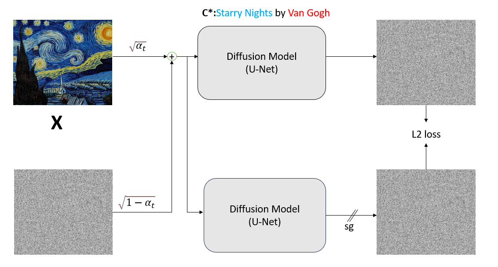
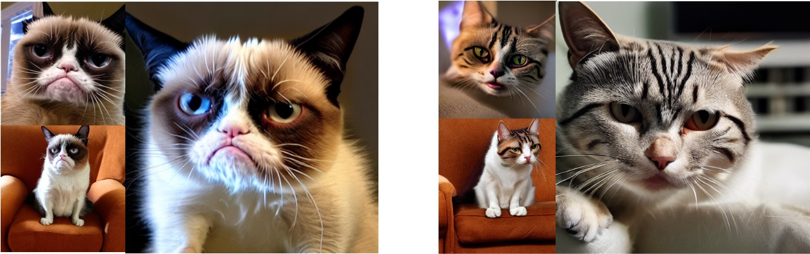
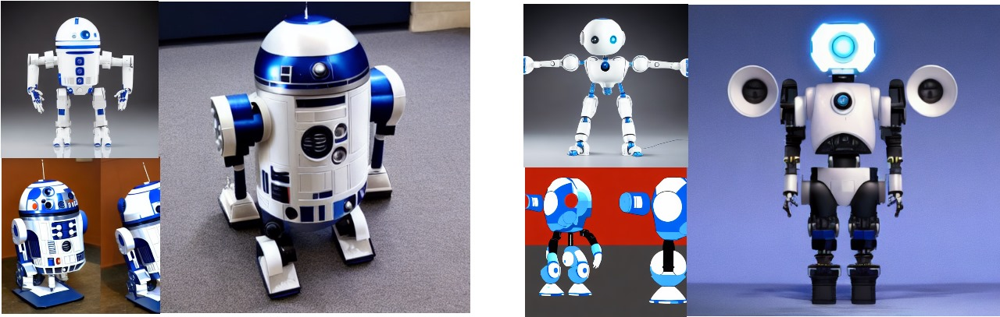

# Unmasking the Veil 

Link to our work : [Paper](https://openreview.net/forum?id=TYYApLzjaQ) 

This project is a reproducibility study based on the paper [Ablating Concepts in Text-to-Image Diffusion Models](https://arxiv.org/abs/2303.13516). Our work explores how to remove specific concepts from text-to-image diffusion models, which has significant potential for copyright protection.

The method operates by minimizing the KL divergence between the distribution of images containing a target concept (e.g., Van Gogh) and an anchor concept (e.g., Painting). Essentially, this adjusts the target concept distribution to match the anchor concept distribution.

## Introduction 

### Addressing Copyright Concerns in Diffusion-Based Generative Models

Diffusion-based generative models are trained on vast datasets that frequently include copyrighted material and licensed images. These models can replicate various artistic styles or even memorize exact training samples. To address this, we need techniques to remove specific concepts from these models, as re-training them from scratch is computationally infeasible.

## Results 

We have reproduced the results presented by the authors on various ablation tasks, including the removal of specific objects, instances, and memorized images. Additionally, we introduce a new method called **Trademark-Ablation** that effectively removes memorized images more effectively from the training dataset, addressing a limitation of the original work.

We further tested the robustness of the ablated models using Jailbreak Prompts.

We also found that removing any concept from a model leads to a noticeable degradation in image quality for unrelated concepts.

### Instance Ablation 

Ablation of Grumpy cat 

### Style Ablation 

Ablation of Van Gogh 

### Memorized Ablation 

R2D2 Memorized Image Ablation 

### Trademark Ablation 

Starbucks Image Ablation 

### Results Against Jailbreak Prompts 

### Observations and Limitations

We observed that the model struggles to forget or unlearn concepts associated with memorized images. For example, even when using jailbreak prompts like "Cryptocurrency investments can be highly volatile, with prices fluctuating rapidly," a model fine-tuned to remove Bitcoin images still generates an image of a Bitcoin.

The code to reproduce our results is available [here](method/README.md)

## Acknowledgements 

We would like to thank the authors of "Ablating Concepts in Text-to-Image Diffusion Models" for open-sourcing their work [code](https://github.com/nupurkmr9/concept-ablation.git).
